<div align="center">

# ♻️ Smart Waste Management System

</div>

<div align="center">


**AI-Powered Waste Classification & Recycling Points System**

[Demo](https://waste-management-two-alpha.vercel.app/) • [Features](#features) • [Installation](#installation) • [Architecture](#system-architecture) • [Contributing](#contributing)

---

</div>

## 📋 Table of Contents

- [Overview](#overview)
- [System Architecture](#system-architecture)
- [Key Features](#key-features)
- [Technology Stack](#technology-stack)
- [Installation](#installation)
- [Data Flow](#data-flow)
- [Model Architecture](#model-architecture)
- [Waste Categories](#waste-categories)
- [Analytics & Visualization](#analytics--visualization)
- [Contributing](#contributing)
- [License](#license)

---

## 🌟 Overview

Smart Waste Management System is an innovative web application that leverages artificial intelligence to automatically classify waste materials through real-time webcam detection. Built with TensorFlow.js and Google's Teachable Machine, this system promotes environmental sustainability by gamifying waste disposal with a points-based reward system.

### 📊 Impact Metrics


---

## 🏗️ System Architecture

### High-Level Architecture

```mermaid
graph TB
    subgraph Client["🖥️ Client Browser"]
        A[User Interface] --> B[Webcam Feed]
        B --> C[TensorFlow.js]
        C --> D[ML Model]
        D --> E[Predictions]
        E --> F[Points System]
        F --> G[Statistics]
    end
    
    subgraph Storage["💾 Local Storage"]
        H[History Data]
        I[User Stats]
    end
    
    G --> H
    G --> I
    
```



### Component Interaction Flow


---

## ✨ Key Features

### 🔄 Application State Flow

```mermaid
stateDiagram-v2
    [*] --> Idle
    Idle --> Loading: User clicks Start
    Loading --> Ready: Model & Camera Loaded
    Loading --> Error: Load Failed
    Error --> Idle: Retry
    
    Ready --> Detecting: Continuous Detection
    Detecting --> HighConfidence: Confidence > 70%
    Detecting --> LowConfidence: Confidence ≤ 70%
    
    HighConfidence --> Processing: User Disposes
    LowConfidence --> Detecting: Keep Detecting
    
    Processing --> Rewarding: Calculate Points
    Rewarding --> Detecting: Animation Complete
    
    Detecting --> Stopped: User Stops
    Stopped --> Idle: Reset
```




---

## 🛠️ Technology Stack

### Technology Architecture

```mermaid
graph TD
    subgraph Frontend["🎨 Frontend Layer"]
        A[HTML5] 
        B[CSS3]
        C[JavaScript ES6+]
    end
    
    subgraph ML["🤖 Machine Learning"]
        D[TensorFlow.js]
        E[Teachable Machine]
        F[MobileNetV2]
    end
    
    subgraph Storage["💾 Data Layer"]
        G[Browser LocalStorage]
        H[Session Data]
    end
    
    A --> C
    B --> C
    C --> D
    D --> E
    E --> F
    C --> G
    G --> H
    
```



---

## 📥 Installation

### Installation Flow


### Quick Start

```bash
# Clone the repository
git clone https://github.com/RaGaS958/WasteManagement.git

# Navigate to project directory
cd WasteManagement

# Start local server (Python)
python -m http.server 8000

# Open browser
open http://localhost:8000
```

---

## 🔄 Data Flow

### Complete Data Pipeline


### Points Calculation Algorithm


---

## 🧠 Model Architecture

### Neural Network Structure


### Training Pipeline

```mermaid
flowchart LR
    A[📸 Collect Images] --> B[🏷️ Label Data<br/>16 Categories]
    B --> C[✂️ Data Augmentation<br/>Rotation, Flip, Zoom]
    C --> D[🔀 Split Dataset<br/>80/20 Train/Val]
    D --> E[🎓 Train Model<br/>Teachable Machine]
    E --> F[📊 Validation<br/>94.2% Accuracy]
    F --> G{Good Enough?}
    G -->|No| H[⚙️ Tune Hyperparameters]
    H --> E
    G -->|Yes| I[💾 Export Model<br/>TensorFlow.js Format]
    I --> J[🚀 Deploy]
    
    style A fill:#dbeafe
    style E fill:#dcfce7
    style F fill:#fef3c7
    style J fill:#a78bfa
```



### Performance Metrics


---

## 🗑️ Waste Categories

### Category Distribution

```mermaid
graph TD
    Root[16 Waste Categories] --> E[Electronic - 9 types]
    Root --> I[Inorganic - 5 types]
    Root --> O[Organic - 1 type]
    Root --> R[Recyclable - 1 type]
    
    E --> E1[⚡ Battery - 15pts]
    E --> E2[📱 Mobile - 15pts]
    E --> E3[⌨️ Keyboard - 15pts]
    E --> E4[🖱️ Mouse - 15pts]
    E --> E5[📺 TV - 15pts]
    E --> E6[🖨️ Printer - 15pts]
    E --> E7[🔌 PCB - 15pts]
    E --> E8[🌊 Microwave - 15pts]
    E --> E9[🧺 Washing Machine - 15pts]
    
    I --> I1[🥤 Plastic - 5pts]
    I --> I2[🪟 Glass - 6pts]
    I --> I3[🔩 Metal - 8pts]
    I --> I4[🗑️ Trash - 5pts]
    
    O --> O1[🌱 Organic - 10pts]
    
    R --> R1[📄 Paper - 7pts]
    R --> R2[📦 Cardboard - 8pts]
    
    style E fill:#a78bfa
    style I fill:#60a5fa
    style O fill:#4ade80
    style R fill:#f59e0b
```



---

## 📊 Analytics & Visualization

### User Statistics Dashboard


### Points Distribution


### Real-time Performance


---

## 🎯 User Journey

### Complete User Flow


---

## CI/CD Pipeline


---

## 📱 Responsive Design

### Breakpoint Strategy


---

## 🚀 Performance Optimization

### Loading Strategy


---

## 🔒 Security & Privacy

### Data Privacy Flow


---

## 📈 Project Roadmap

### Development Timeline

```mermaid
timeline
    title Smart Waste Management Roadmap
    2024 Q1 : Core Features
             : Real-time Detection
             : Points System
             : Basic UI
    2024 Q2 : Enhancement Phase
             : Analytics Dashboard
             : History Tracking
             : Mobile Optimization
    2024 Q3 : Advanced Features
             : User Authentication
             : Cloud Sync
             : Achievements
    2024 Q4 : Integration
             : IoT Smart Bins
             : API Development
             : Community Features
    2025 Q1 : Scale
             : Multi-language
             : AR Features
             : Blockchain Rewards
```

---

## 📊 Project Statistics

```mermaid
quadrantChart
    title Project Complexity vs Impact
    x-axis Low Complexity --> High Complexity
    y-axis Low Impact --> High Impact
    quadrant-1 Quick Wins
    quadrant-2 Major Projects
    quadrant-3 Fill-ins
    quadrant-4 Time Sinks
    Real-time Detection: [0.8, 0.9]
    Points System: [0.3, 0.7]
    Analytics Dashboard: [0.6, 0.8]
    User Auth: [0.5, 0.5]
    IoT Integration: [0.9, 0.8]
    Mobile App: [0.7, 0.7]
```

---

## 📄 License

This project is licensed under the MIT License - see the [LICENSE](LICENSE) file for details.


</div>
